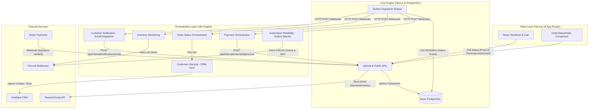

# System Architecture & Technical Specification

The **AI E-commerce Automation Hub** is an event-driven e-commerce fulfillment platform engineered with a **transactional outbox pattern**, **PostgreSQL atomic concurrency controls**, **two-phase consumer deduplication**, and **n8n workflow orchestration**.

---

## 1. System Overview



---

## 2. Component Responsibilities

| Component | Architecture Role | Responsibilities |
| :--- | :--- | :--- |
| **Next.js Storefront** | Client Application | Manages cart state in `localStorage`, drives `/cart` navigation, initiates Stripe Checkout sessions, and polls order status. |
| **PostgreSQL Database** | Authoritative Source of Truth | Stores products, orders, customers, Stripe idempotency logs, outbox events, and consumer deduplication claims (`ConsumerEvent`). |
| **Transactional Outbox Engine** | Durable Event Dispatcher | Atomically claims `PENDING` events, enforces deterministic retry backoff, recovers stale processing leases, and dispatches webhooks. |
| **n8n Engine** | Event Orchestrator | Handles workflow routing, CRM synchronization, operational Discord notifications, and customer email dispatch loops. |
| **Stripe Hosted Checkout** | Payment Gateway | Processes credit card payments, enforces webhook signature verification (`STRIPE_WEBHOOK_SECRET`), and posts `payment_intent.succeeded`. |
| **HubSpot CRM** | Business Operations | Stores Customer Contacts by email and Order Deals by `external_order_id`, tracking deal stages (`PROCESSING`, `SHIPPED`, `DELIVERED`). |
| **Resend API** | Email Provider | Renders and delivers HTML transactional emails (`PROCESSING`, `SHIPPED`, `DELIVERED`) using provider-side `Idempotency-Key` headers. |

---

## 3. Database Domain Model

```prisma
// PostgreSQL Schema Summary (Prisma 8 Contract-Driven)

model Product {
  id                String   @id @default(dbgenerated("gen_random_uuid()"))
  slug              String   @unique
  name              String
  priceCents        Int
  stock             Int
  lowStockThreshold Int      @default(5)
  category          String
}

model Order {
  id                      String        @id @default(dbgenerated("gen_random_uuid()"))
  customerId              String
  status                  OrderStatus   @default(PENDING) // PENDING, PROCESSING, ON_HOLD, SHIPPED, DELIVERED, CANCELLED
  paymentStatus           PaymentStatus @default(PENDING) // PENDING, PAID, FAILED, REFUNDED
  stripeCheckoutSessionId String?       @unique
  stripePaymentIntentId   String?
  carrier                 String?
  trackingNumber          String?
}

model OutboxEvent {
  id            String       @id @default(dbgenerated("gen_random_uuid()"))
  eventType     String       // PAYMENT_SUCCEEDED, INVENTORY_UPDATED, ORDER_STATUS_UPDATED, ORDER_*_NOTIFICATION
  aggregateType String
  aggregateId   String
  payload       Json
  status        OutboxStatus @default(PENDING) // PENDING, PROCESSING, DELIVERED, FAILED
  attemptCount  Int          @default(0)
  nextAttemptAt TimestamptzString?
  lastAttemptAt TimestamptzString?
  lastError     String?
}

model ConsumerEvent {
  id           String            @id @default(dbgenerated("gen_random_uuid()"))
  consumerId   String            // 'hubspot-crm-sync', 'email-notifier', 'outbox-monitor-alert', etc.
  eventId      String
  status       String            @default("PROCESSING") // PROCESSING, COMPLETED
  attemptCount Int               @default(1)
  claimedAt    TimestamptzString @default(now())
  completedAt  TimestamptzString?

  @@unique([consumerId, eventId])
}
```

---

## 4. Reliability Mechanisms

### Transactional Outbox Pattern
To eliminate dual-write hazards, domain state mutations and event log creation occur inside the **same PostgreSQL database transaction**:
```typescript
await db.transaction(async (tx) => {
  // 1. Update Order Status in PostgreSQL
  await tx.orm.public.Order.where({ id }).update({ status: 'PROCESSING' });

  // 2. Insert Outbox Event in SAME Transaction
  await tx.orm.public.OutboxEvent.create({
    eventType: 'ORDER_PROCESSING_NOTIFICATION',
    aggregateType: 'Order',
    aggregateId: id,
    payload: { orderId: id, status: 'PROCESSING' },
  });
});
```
Because both operations commit atomically, it is physically impossible to persist an order state change without creating its corresponding outbox notification event.

### Atomic Concurrency Protection
To prevent overselling under concurrent checkouts, stock decrements use atomic conditional SQL updates:
```sql
UPDATE "product"
SET "stock" = "stock" - $1
WHERE "id" = $2 AND "stock" >= $1;
```
If stock is insufficient at mutation time, 0 rows are updated, the transaction rolls back, and no inventory or outbox events are generated.

### Two-Phase Consumer Deduplication (`ConsumerEvent`)
Every consumer (e.g. n8n workflow) claims an event before executing side effects:
1. **Claim** (`POST /api/internal/events/claim`): Atomically inserts `(consumerId, eventId)` with `status: 'PROCESSING'`. If `status === 'COMPLETED'`, returns `canProcess: false`.
2. **Execute Side Effects**: Send email, update CRM, post Discord notification.
3. **Complete** (`POST /api/internal/events/complete`): Updates `status: 'COMPLETED'`.
On duplicate redeliveries, `/claim` returns `canProcess: false` (`status: 'COMPLETED'`), preventing duplicate side effects.

### Provider-Side Idempotency (Resend)
When delivering customer emails, the backend passes the outbox `eventId` as the `Idempotency-Key` HTTP header to Resend:
```typescript
await resend.emails.send(payload, { idempotencyKey: payload.eventId });
```
If a worker crashes after sending an email but before calling `/events/complete`, a subsequent redelivery sends the identical `Idempotency-Key`. Resend suppresses sending a second duplicate email to the customer.

---

## 5. Security Model

```text
               Public Internet                      Protected Internal Boundary
 ┌──────────────────────────────────────┐     ┌──────────────────────────────────────┐
 │ • Storefront UI                      │     │ • Internal APIs (/api/internal/*)    │
 │ • Public Order Status (/api/orders/*)│     │   - Requires X-Automation-Secret     │
 │ • Stripe Webhook Listener            │     │ • PostgreSQL Database (Neon)         │
 └──────────────────────────────────────┘     └──────────────────────────────────────┘
```

1. **Internal API Protection**: All endpoints under `/api/internal/*` require the `X-Automation-Secret` HTTP header matching `N8N_AUTOMATION_SECRET`.
2. **Stripe Webhook Signature Verification**: `POST /api/webhooks/stripe` verifies the cryptographic signature (`Stripe-Signature`) using the raw request body and `STRIPE_WEBHOOK_SECRET`.
3. **Order Status Polling Authorization**: `GET /api/orders/[id]/status` and `/orders/[id]` enforce proof-of-purchase authorization. Requests succeed **ONLY** when `session_id` query parameter matches `order.stripeCheckoutSessionId`. Unauthorized requests return `403 Forbidden` on API and `404 Not Found` on UI, preventing PII exposure.

---

## 6. Known Limitations & Production Hardening Notes

* **At-Least-Once Delivery**: The outbox engine guarantees at-least-once delivery. Subscriptions and consumers MUST be idempotent.
* **No Zero Event Loss Guarantee**: Uncommitted database transactions during catastrophic host failure or storage corruption prior to WAL flush will lose in-flight state.
* **Local Development Webhooks**: In local development, webhooks run on HTTP (`http://localhost:5678`). Production deployment requires HTTPS webhooks and a secret manager (e.g. AWS Secrets Manager or Vault).
